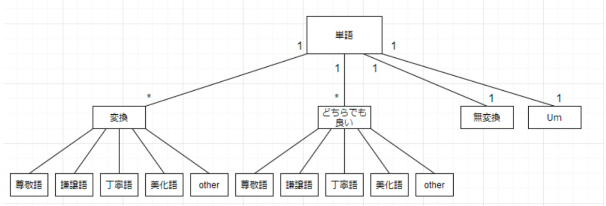

# keigo_transfer_task

本リポジトリでは、東北大学 乾研究室で構築した日本語学習者支援のための敬語変換タスクにおける評価用データセット、およびその構築方法を公開しています。

## 評価用データセット
本リポジトリには敬語変換タスクの評価用データセットが含まれます。
評価用データセットは敬語変換を行う前の元文と変換後の文、そして変換に対して付与されたラベルの3つの要素からなります。
| 元文                                                             | 変換文                                                             | 変換ラベル  | 
| ---------------------------------------------------------------- | ------------------------------------------------------------------ | ----------- | 
| 朝ごはんはトーストにバターとべジマイトを薄くぬって食べました。	  | 朝ごはんはトーストにバターとべジマイトを薄くぬっていただきました。 | 変換:謙譲語 | 
| でも友達はもしその理由で別れたら彼がかわいそうだと答えました。		 | でも友達はもしその理由で別れたら彼がかわいそうだと答えました。     | 無変換      | 

変換が行われた場合、`:`区切りで変換した敬語の種類がラベル付けされます。
`annot_data_1.csv`,`annot_data_2.csv`に2人のアノテータによってそれぞれ構築されたデータセットを公開します。

## 評価用データセットの構築方法
敬語表現への知識と十分な日本語読解能力を有する2名の日本人作業者によって、敬語が必ずしも使われていない日本語文390文に対して敬語変換を行いました。
この際、各変換に対して下図のように変換必要性、そして変換の種類を表す2段階のラベル付けを行いました。評価用データセットの構築方法の詳細やデータセットの特徴は下記の原稿を参照ください。

## 参考文献
[松本 悠太、林崎 由、北山 晃太郎、舟山 弘晃、三田 雅人、乾 健太郎: 日本語学習者支援のための敬語変換タスクの提案](https://confit.atlas.jp/guide/event-img/jsai2022/3Yin2-39/public/pdf?type=in "JSAI2022")

